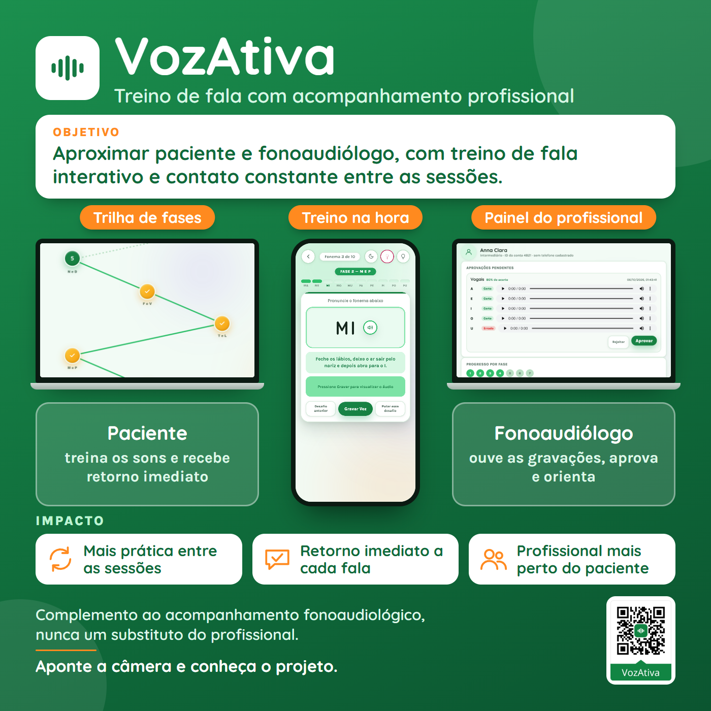
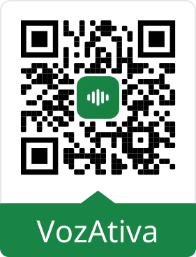

# VozAtiva

**Treino de fala com acompanhamento profissional.** Aplicativo web para pessoas em acompanhamento fonoaudiológico: o paciente vê um fonema, ouve a pronúncia correta, grava a própria voz e recebe retorno na hora, numa trilha de fases inspirada em jogos. O fonoaudiólogo acompanha os pacientes vinculados, ouve cada tentativa gravada, aprova ou pede repetição e cria exercícios personalizados.

> O VozAtiva é um complemento ao acompanhamento fonoaudiológico já realizado com um profissional — não um substituto dele.

**Projeto número 160.** Idealizador: Luan Campos · Orientador: Renan Sthel · Desenvolvedor: Paulo Ricardo Mendes Cândido · Desenvolvimento auxiliado por Claude (Anthropic).

## Em resumo

| | |
|---|---|
| **Problema** | Entre uma sessão de fonoaudiologia e outra, o paciente treina sozinho, sem retorno imediato, e o profissional não vê o que foi praticado. |
| **Objetivo** | Aproximar paciente e fonoaudiólogo, com treino de fala interativo e contato constante entre as sessões. |
| **Para quem** | Pacientes em acompanhamento fonoaudiológico e os fonoaudiólogos que os atendem. |
| **Estado atual** | Protótipo funcional completo, rodando 100% no navegador, sem servidor. Reconhecido no Prêmio Inatel Startups da 45ª FETIN. |
| **O que ainda não existe** | Servidor/banco de dados (hoje os dados ficam no próprio dispositivo) e validação clínica formal. Ver [Limitações conhecidas](#limitações-conhecidas) e o [roadmap](docs/ROADMAP.md). |

## Índice

- [Reconhecimento](#reconhecimento)
- [O que o app faz](#o-que-o-app-faz)
- [Como funciona na prática](#como-funciona-na-prática)
- [Teste rápido (demonstração)](#teste-rápido-demonstração)
- [Requisitos e compatibilidade](#requisitos-e-compatibilidade)
- [Limitações conhecidas](#limitações-conhecidas)
- [Tecnologias](#tecnologias)
- [Estrutura do repositório](#estrutura-do-repositório)
- [Como executar localmente](#como-executar-localmente)
- [Como testar](#como-testar)
- [Manutenção e desenvolvimento](#manutenção-e-desenvolvimento)
- [Documentação](#documentação)
- [Equipe e créditos](#equipe-e-créditos)
- [Contato e licença](#contato-e-licença)

## Reconhecimento

O projeto recebeu reconhecimento do **Inatel Startups** pelo destaque no **Prêmio Inatel Startups da 45ª FETIN** (Feira Tecnológica do Inatel, 24 a 26 de setembro de 2026): a equipe demonstrou atitude empreendedora, visão de mercado, clareza na apresentação e espírito inovador. Durante as apresentações, o público testou ao vivo todas as funcionalidades. Relatório, infográfico e detalhes em [`docs/FETIN-2026.md`](docs/FETIN-2026.md).

<p align="center"></p>

## O que o app faz

**Paciente**
- Treina 65 fonemas do português (vogais + 6 pares de letras; conjunto inicial, pensado para crescer) em uma trilha de 7 fases, com reconhecimento de fala e retorno imediato.
- Ouve a pronúncia correta de cada fonema em voz feminina ou masculina (gravações reais, não só síntese de voz).
- Acompanha sequência diária de treino (streak), ranking entre amigos e um nível de "Revisão" para os fonemas que o fonoaudiólogo pediu para repetir.
- Tem uma central de exercícios práticos (vídeos) e um chat com contas vinculadas (fonoaudiólogo, amigos), com texto, áudio, foto e vídeo.

**Fonoaudiólogo**
- Vincula pacientes por um ID de 4 dígitos (o paciente precisa confirmar o convite) e acompanha o progresso de cada um, fase por fase.
- Ouve o áudio de cada tentativa gravada e aprova ou rejeita — rejeitar manda aqueles fonemas de volta ao paciente, num nível de revisão separado.
- Vê o rendimento geral (acertos x erros) e os erros recorrentes, com o botão "Pedir repetição".
- Cria fases e exercícios personalizados por paciente (fonemas extras, dicas próprias, áudio próprio, som sustentado).

**Para todos:** tutorial guiado (spotlight) e central de ajuda embutidos, acessibilidade (navegação por teclado, `aria-live`, alvos de toque de 44px, modo de movimento reduzido) e tema claro/escuro em todas as telas.

## Como funciona na prática

1. **Criar a conta** e escolher o perfil: paciente ou fonoaudiólogo(a).
2. **Paciente:** abre a trilha de fases e escolhe a fase atual. Cada fase libera a próxima só depois de concluída.
3. **No exercício**, o paciente vê o fonema, toca no alto-falante para ouvir a pronúncia, lê a instrução de como posicionar lábios e língua e toca em **Gravar**. O app reconhece a fala, mostra certo ou errado e avança sozinho.
4. **Ao fim da fase**, um resumo mostra acertos, erros e pulos. A fase só conta como concluída com **65% de aproveitamento**, e cada fase permite no máximo **3 pulos**.
5. **A fase concluída vira uma revisão** para o fonoaudiólogo vinculado, que ouve as tentativas e aprova ou rejeita. A revisão não bloqueia o paciente: é uma auditoria em paralelo.
6. **Se o profissional rejeitar**, os fonemas voltam ao paciente no nível "Revisão" da trilha.

Como o app decide se a fala está certa: o navegador reconhece a fala (Web Speech API) e o app compara o texto reconhecido com o fonema esperado. Se o reconhecimento não responder, entra uma regra de reserva baseada em volume e duração, e a tentativa fica marcada como **"não verificado por voz"** para que o fonoaudiólogo saiba quais respostas não foram confirmadas por reconhecimento real.

## Teste rápido (demonstração)

1. Suba o app (ver [Como executar localmente](#como-executar-localmente)) e abra `http://localhost:5500`.
2. **Caminho rápido:** entre com a conta de demonstração **`admin@admin`** / senha **`123456`**. É uma conta de paciente com a trilha toda liberada (sem bloqueio de pré-requisito e sem limite de pulos), feita para apresentar o app. Ela existe só para demonstração e não deve ser usada com dados reais.
3. **Caminho completo (paciente + profissional):**
   1. Crie uma conta de **paciente**; o ID de 4 dígitos fica em *Meu Perfil*.
   2. Saia e crie uma conta de **fonoaudiólogo(a)**.
   3. No painel do profissional, digite o ID do paciente em *Adicionar novo paciente*.
   4. Entre de novo como paciente e **confirme o convite** que aparece na tela inicial.
   5. Treine e conclua uma fase; depois entre como profissional, abra o paciente e **aprove ou rejeite** a revisão.

Todos os dados ficam no navegador usado no teste; limpar os dados do site apaga as contas.

## Requisitos e compatibilidade

- **Navegador:** recomendado Google Chrome ou Microsoft Edge (reconhecimento de fala completo). Em navegadores sem suporte a reconhecimento de fala, o app continua funcionando com a regra de reserva (volume e duração) e marca as tentativas como "não verificado por voz".
- **Microfone** liberado para o site, em computador ou celular.
- **Servidor HTTP local** (o app não funciona aberto direto como arquivo `file://`). Ver [Como executar localmente](#como-executar-localmente).
- **Internet:** necessária para carregar duas fontes do Google Fonts e, no Chrome e no Edge, para o reconhecimento de fala (processado pelo serviço do próprio navegador). O app em si não envia dados a nenhum servidor do projeto.
- **Instalação:** nenhuma — não há `npm install`, bundler nem build.

## Limitações conhecidas

São decisões de escopo da primeira versão, não esquecimentos:

- **Sem servidor nem banco de dados:** os dados ficam por dispositivo. Por isso o vínculo entre fonoaudiólogo e paciente só funciona entre contas no mesmo dispositivo; o uso em vários aparelhos depende do backend planejado (ver [roadmap](docs/ROADMAP.md)).
- **Verificação de fala:** depende do reconhecimento do navegador, com regra de reserva por volume e duração. Não há avaliação fonética especializada.
- **Sem validação clínica formal:** houve avaliação de três especialistas e teste ao vivo com o público na FETIN, mas não um estudo clínico controlado.
- **Conta de demonstração pública:** `admin@admin` está no código por decisão de demonstração; seria removida antes de qualquer uso com dados reais.
- **Reconhecimento de fala online:** no Chrome e no Edge, o áudio enviado ao reconhecimento é processado pelo serviço do próprio navegador (fora do controle do VozAtiva). Contas, progresso e gravações das tentativas ficam só no dispositivo.
- **Segurança local:** a senha é guardada com hash SHA-256 e sal único por conta, mas isso só protege dentro do dispositivo; autenticação no servidor é item do roadmap.

## Tecnologias

- **HTML5 + CSS3 + JavaScript (ES6+), sem framework e sem build step.** Decisão deliberada: um projeto acadêmico de demonstração ganha mais em ser 100% legível e rodável com um clique do que em usar um framework. Três arquivos (`index.html`, `script.js`, `style.css`): abra e funciona.
- **Web Speech API** (`SpeechRecognition`) — reconhecimento de fala, com uma regra de volume/duração como reserva quando o navegador não suporta ou não responde a tempo.
- **Web Audio API** (`AudioContext`/`AnalyserNode`) — captura e visualização (onda) do microfone em tempo real.
- **MediaRecorder** — grava o áudio de cada tentativa, para o fonoaudiólogo ouvir e aprovar.
- **Web Crypto** — hash SHA-256 com sal único por conta; a senha nunca é guardada em texto puro.
- **`localStorage`** — contas, progresso e mensagens de texto (modelo de dados em [`docs/ARQUITETURA.md`](docs/ARQUITETURA.md)).
- **`IndexedDB`** — mídia grande (áudio de tentativas, anexos de chat, vídeos de exercício).

Nenhuma dependência de terceiros é baixada em tempo de execução, exceto duas Google Fonts carregadas por `<link>`.

## Estrutura do repositório

```
.
├── index.html                  # todas as telas/painéis do app (um único HTML)
├── script.js                   # toda a lógica (estado, regras, persistência)
├── style.css                   # todo o visual (tema claro/escuro, responsivo)
├── fonemas-audio/
│   ├── feminina/                # 65 gravações reais (voz feminina — Anna Clara)
│   ├── masculina/                # 65 gravações reais (voz masculina — Paulo Ricardo)
│   └── LEIA-ME.txt              # como funciona a escolha/fallback de áudio
├── avatares/                    # ícones de perfil predefinidos (SVG)
├── identidade-visual/           # logo, QR code do repositório e imagem de pré-visualização
├── docs/
│   ├── README.md                # índice da documentação
│   ├── ARQUITETURA.md           # como o código está organizado por dentro
│   ├── ROADMAP.md               # planos futuros — implementado x planejado x possibilidade
│   ├── MODELO-DE-NEGOCIO.md     # análise de monetização (nenhuma decisão tomada ainda)
│   ├── FETIN-2026.md            # reconhecimento na 45ª FETIN, relatório e infográfico
│   ├── fetin/                   # infográfico (1400x1400) do relatório da FETIN
│   └── CONTEXTO_PROJETO_v5.txt  # changelog detalhado, rodada a rodada
├── .claude/
│   ├── launch.json              # configuração do servidor local de dev
│   └── static-server.ps1        # servidor HTTP estático (PowerShell, sem dependências)
├── Iniciar VozAtiva.bat         # atalho Windows: sobe o servidor e abre o navegador
├── LICENSE                      # todos os direitos reservados
└── .gitignore
```

Veja [`docs/ARQUITETURA.md`](docs/ARQUITETURA.md) para uma explicação de **onde mexer** para cada tipo de mudança (adicionar um fonema, mudar uma regra de negócio, mudar o tema, etc.).

## Como executar localmente

O app é só HTML/CSS/JS estático — mas **precisa ser servido por HTTP**, nunca aberto direto como arquivo (`file://`). Abrir como arquivo quebra permissões do navegador (microfone é pedido de novo a cada exercício) e o carregamento dos áudios de fonema.

**Windows — mais simples:** dê duplo clique em [`Iniciar VozAtiva.bat`](Iniciar%20VozAtiva.bat). Ele sobe um servidor local na porta 5500 e abre `http://localhost:5500` no navegador padrão.

**Manual (qualquer sistema com PowerShell, ou qualquer outro servidor estático):**
```powershell
powershell -ExecutionPolicy Bypass -File .claude/static-server.ps1 -Port 5500
```
depois abra `http://localhost:5500` no navegador. Qualquer outro servidor estático (`npx serve`, `python -m http.server`, extensão Live Server, etc.) também funciona — o único requisito é servir a raiz do repositório por HTTP.

## Como testar

Não há suíte de testes automatizados — é um projeto de demonstração acadêmica sem backend, então a validação é feita manualmente, ao vivo no navegador, a cada rodada de mudança (registrado em [`docs/CONTEXTO_PROJETO_v5.txt`](docs/CONTEXTO_PROJETO_v5.txt)). Pra conferir que uma mudança não quebrou nada:

1. Suba o servidor local (seção acima).
2. Abra o console do navegador (F12) e confira que não há erros ao carregar.
3. Teste o fluxo principal: criar conta → trilha → treinar um fonema (com e sem microfone) → concluir uma fase.
4. Se mexeu em algo do fonoaudiólogo: crie uma segunda conta como médico, vincule as duas pelo ID de 4 dígitos, e confira o painel dele.
5. Teste tema claro/escuro e uma largura de tela estreita (celular) na mudança que você fez.

## Manutenção e desenvolvimento

- **Sem build step** — edite `index.html`/`script.js`/`style.css` diretamente e recarregue o navegador.
- **Cache-busting manual**: `index.html` referencia `script.js?v=N` e `style.css?v=N`. Depois de editar um desses dois arquivos, incremente o `v=` correspondente em `index.html`, senão o navegador pode continuar servindo a versão em cache.
- **`docs/CONTEXTO_PROJETO_v5.txt`** é o histórico completo de decisões, uma entrada por rodada de trabalho — consulte antes de mudar algo que pareça estranho à primeira vista; provavelmente já foi discutido e tem um motivo registrado ali.
- Decisões de escopo conscientes (não são pendências esquecidas): sem backend real (tudo fica por dispositivo), sem migração de senha ao trocar o esquema de hash, sem teste clínico formal — o app é um complemento de apoio, não substitui o acompanhamento profissional.

## Documentação

| Documento | Para quê |
|---|---|
| [`docs/README.md`](docs/README.md) | Índice de toda a documentação, com o que cada arquivo responde. |
| [`docs/ARQUITETURA.md`](docs/ARQUITETURA.md) | Telas, modelo de dados e onde mexer para cada tipo de mudança. |
| [`docs/ROADMAP.md`](docs/ROADMAP.md) | O que está implementado, planejado ou só em análise. |
| [`docs/MODELO-DE-NEGOCIO.md`](docs/MODELO-DE-NEGOCIO.md) | Análise de monetização (nenhuma decisão de comercializar foi tomada). |
| [`docs/FETIN-2026.md`](docs/FETIN-2026.md) | Reconhecimento na FETIN, textos do relatório e infográfico. |
| [`docs/CONTEXTO_PROJETO_v5.txt`](docs/CONTEXTO_PROJETO_v5.txt) | Histórico detalhado, rodada a rodada. |
| [`fonemas-audio/LEIA-ME.txt`](fonemas-audio/LEIA-ME.txt) | Como funciona a pasta de áudios dos fonemas. |

## Equipe e créditos

- **Idealizador:** Luan Campos
- **Orientador:** Renan Sthel
- **Desenvolvedor:** Paulo Ricardo Mendes Cândido
- **Voz feminina:** Anna Clara · **Voz masculina:** Paulo Ricardo
- **Desenvolvimento auxiliado por:** Claude (Anthropic)
- **Especialistas que avaliaram o projeto:** Maria de Mello (Gerontecnologia), Liliane e Bárbara Alves (Fonoaudiologia)

## Contato e licença

Dúvidas, sugestões ou interesse no projeto: abra uma [issue](https://github.com/paulinkappa/fetin2026/issues) neste repositório. O repositório é público para consulta e avaliação, com **todos os direitos reservados**: não há licença de uso, cópia, modificação ou uso comercial sem autorização dos autores. Veja o arquivo [`LICENSE``](LICENSE).

## Acesso rápido



Aponte a câmera do celular pra abrir este repositório.
